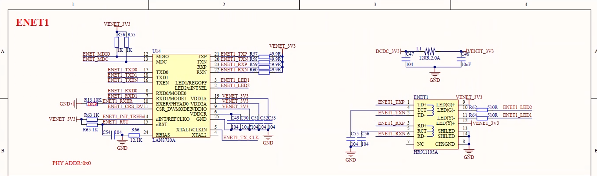
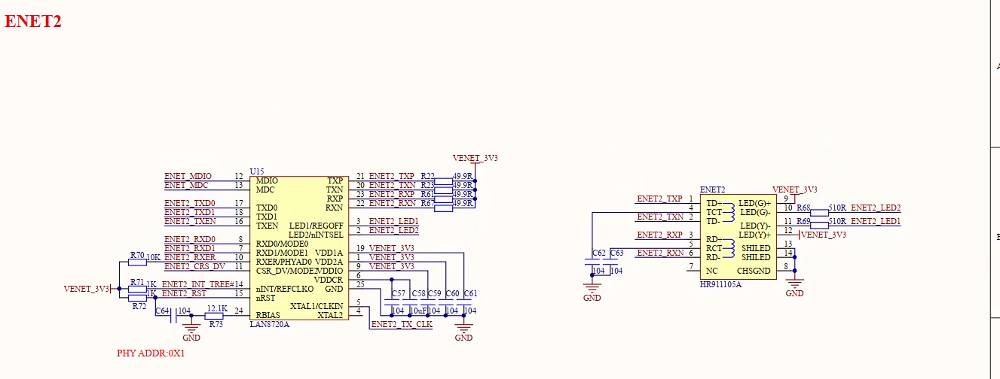
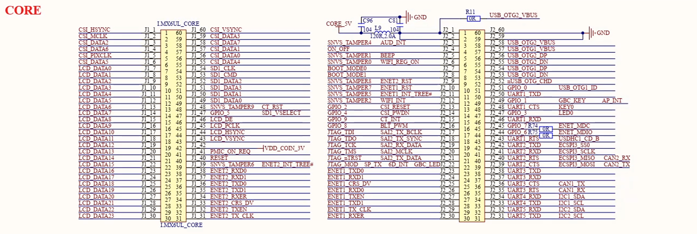
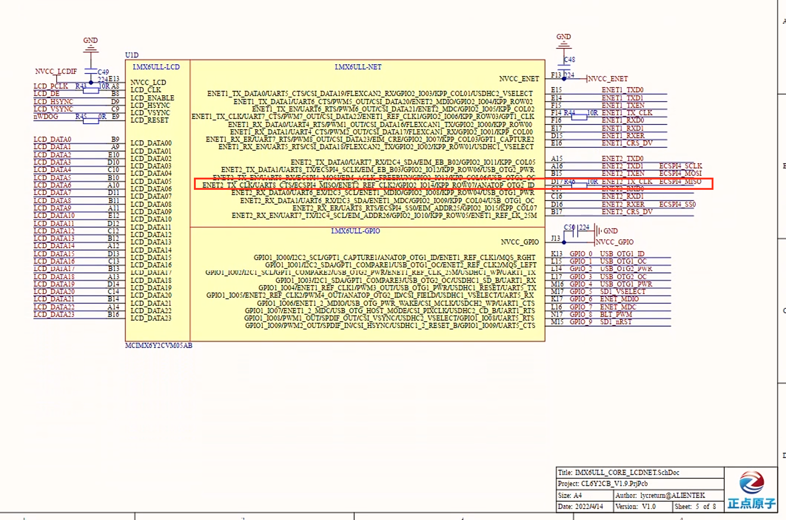

> 配置第二个网卡

# 参考文件

- IMX6ULL数据手册(工业级).pdf
- IMX6ULL勘误手册.pdf
- IMX6ULL参考手册.pdf

# 底板原理图

- 网卡

eth1: phyId 0

eth2: phyId 1





- 扣板

原理图上的 J1_1 ~ 60和J2_1 ~ 60在扣板上都能看到标识.

ENET2_TX_CLK引脚在CPU标注的是D17(page 117)在数据手册中，刚好对应j1_31这个扣板引脚.

<mark/>Note: 类似 J1, J2 的扣板引脚在数据手册中是没有的，只有在原理图上才能看到对应关系.</mark>





# uboot

<mark/>目的是否能在uboot下启动第二个网卡eth1</mark>

- defconfig文件参考的是`mx6ull_14x14_ddr256_nand_defconfig`文件，内容为
CONFIG_SYS_EXTRA_OPTIONS="IMX_CONFIG=board/freescale/mx6ullevk/imximage-ddr256.cfg,SYS_USE_NAND"，找到这个路径.

- 进入`board/freescale/mx6ullevk`目录，找到`mx6ullevk.c`文件

- 找到`boart_eth_init`函数,发现需要<mark/>CONFIG_FEC_ENET_DEV, CONFIG_FEC_MXC_PHYADDR, IMX_FEC_BASE</mark>这三个宏,但是在2016这个uboot版本中，.config文件中没有这三个宏的定义，所以需要确认宏定义位置

```c

int board_eth_init(bd_t *bis)
{
	setup_iomux_fec(CONFIG_FEC_ENET_DEV);

	return fecmxc_initialize_multi(bis, CONFIG_FEC_ENET_DEV,
				       CONFIG_FEC_MXC_PHYADDR, IMX_FEC_BASE);
}

```

- 在`board/freescale/mx6ullevk/imximage-ddr256.cfg.cfgtmp`和/`board/freescale/mx6ullevk/.mx6ullevk.o.cmd`文件中都发现有 `include/configs/mx6ullevk.h`

- 在`include/configs/mx6ullevk.h`文件中，发现有这三个宏的定义,使能的是ENET2_BASE_ADDR，<mark/>所以确认是否可以通过修改`board_eth_init`来创建网卡</mark>

```c 
#ifdef CONFIG_CMD_NET
#define CONFIG_CMD_PING
#define CONFIG_CMD_DHCP
#define CONFIG_CMD_MII
#define CONFIG_FEC_MXC
#define CONFIG_MII

#define CONFIG_FEC_ENET_DEV		1

#if (CONFIG_FEC_ENET_DEV == 0)
#define IMX_FEC_BASE			ENET_BASE_ADDR
#define CONFIG_FEC_MXC_PHYADDR          0x0
#define CONFIG_FEC_XCV_TYPE             RMII
#elif (CONFIG_FEC_ENET_DEV == 1)
#define IMX_FEC_BASE			ENET2_BASE_ADDR
#define CONFIG_FEC_MXC_PHYADDR		0x1
#define CONFIG_FEC_XCV_TYPE		RMII
#endif
#define CONFIG_ETHPRIME			"FEC"

#define CONFIG_PHYLIB
#define CONFIG_PHY_SMSC
#endif
```


- 在`setup_iomux_fec`函数中，发现fec_id来创建不同的网卡，但是结构体`fec1_pads`和`fec2_pads`的定义中对`MX6_PAD_GPIO1_IO06__ENET1_MDIO`和`MX6_PAD_GPIO1_IO07__ENET1_MDC`这两个引脚的复用配置是一样的，所以能够确定只能创建一个网卡。


```c 
static iomux_v3_cfg_t const fec1_pads[] = {
	MX6_PAD_GPIO1_IO06__ENET1_MDIO | MUX_PAD_CTRL(MDIO_PAD_CTRL),
	MX6_PAD_GPIO1_IO07__ENET1_MDC | MUX_PAD_CTRL(ENET_PAD_CTRL),
	MX6_PAD_ENET1_TX_DATA0__ENET1_TDATA00 | MUX_PAD_CTRL(ENET_PAD_CTRL),
	MX6_PAD_ENET1_TX_DATA1__ENET1_TDATA01 | MUX_PAD_CTRL(ENET_PAD_CTRL),
	MX6_PAD_ENET1_TX_EN__ENET1_TX_EN | MUX_PAD_CTRL(ENET_PAD_CTRL),
	MX6_PAD_ENET1_TX_CLK__ENET1_REF_CLK1 | MUX_PAD_CTRL(ENET_CLK_PAD_CTRL),
	MX6_PAD_ENET1_RX_DATA0__ENET1_RDATA00 | MUX_PAD_CTRL(ENET_PAD_CTRL),
	MX6_PAD_ENET1_RX_DATA1__ENET1_RDATA01 | MUX_PAD_CTRL(ENET_PAD_CTRL),
	MX6_PAD_ENET1_RX_ER__ENET1_RX_ER | MUX_PAD_CTRL(ENET_PAD_CTRL),
	MX6_PAD_ENET1_RX_EN__ENET1_RX_EN | MUX_PAD_CTRL(ENET_PAD_CTRL),
	MX6_PAD_SNVS_TAMPER7__GPIO5_IO07 | MUX_PAD_CTRL(NO_PAD_CTRL),		/* ETH1 RESET PIN */
};

static iomux_v3_cfg_t const fec2_pads[] = {
	MX6_PAD_GPIO1_IO06__ENET2_MDIO | MUX_PAD_CTRL(MDIO_PAD_CTRL),
	MX6_PAD_GPIO1_IO07__ENET2_MDC | MUX_PAD_CTRL(ENET_PAD_CTRL),

	MX6_PAD_ENET2_TX_DATA0__ENET2_TDATA00 | MUX_PAD_CTRL(ENET_PAD_CTRL),
	MX6_PAD_ENET2_TX_DATA1__ENET2_TDATA01 | MUX_PAD_CTRL(ENET_PAD_CTRL),
	MX6_PAD_ENET2_TX_CLK__ENET2_REF_CLK2 | MUX_PAD_CTRL(ENET_CLK_PAD_CTRL),
	MX6_PAD_ENET2_TX_EN__ENET2_TX_EN | MUX_PAD_CTRL(ENET_PAD_CTRL),

	MX6_PAD_ENET2_RX_DATA0__ENET2_RDATA00 | MUX_PAD_CTRL(ENET_PAD_CTRL),
	MX6_PAD_ENET2_RX_DATA1__ENET2_RDATA01 | MUX_PAD_CTRL(ENET_PAD_CTRL),
	MX6_PAD_ENET2_RX_EN__ENET2_RX_EN | MUX_PAD_CTRL(ENET_PAD_CTRL),
	MX6_PAD_ENET2_RX_ER__ENET2_RX_ER | MUX_PAD_CTRL(ENET_PAD_CTRL),
	MX6_PAD_SNVS_TAMPER8__GPIO5_IO08 | MUX_PAD_CTRL(NO_PAD_CTRL),		/* ETH2 RESET PIN */
};


static void setup_iomux_fec(int fec_id)
{
	if (fec_id == 0){
		imx_iomux_v3_setup_multiple_pads(fec1_pads,
						 ARRAY_SIZE(fec1_pads));
        gpio_direction_output(ENET1_RESET, 1);
        gpio_set_value(ENET1_RESET, 0);
	mdelay(20);
        gpio_set_value(ENET1_RESET, 1);
	} else {
		imx_iomux_v3_setup_multiple_pads(fec2_pads,
						 ARRAY_SIZE(fec2_pads));
        gpio_direction_output(ENET2_RESET, 1);
        gpio_set_value(ENET2_RESET, 0);
	mdelay(20);
        gpio_set_value(ENET2_RESET, 1);
	}
}


```

- 通过MX6_PAD_GPIO1_IO06__ENET2_MDIO这个命名，可知晓是GPIO1_IO06引脚被复用成ENET2_MDIO功能的引脚，在`imx6ull reference manual`中，page 1574中确认GPIO1_IO06是复用引脚，9选1。

```bash
MUX Mode Select Field.
Select 1 of 9 iomux modes to be used for pad: GPIO1_IO06.
0000 ALT0 — Select mux mode: ALT0 mux port: ENET1_MDIO of instance: enet1
0001 ALT1 — Select mux mode: ALT1 mux port: ENET2_MDIO of instance: enet2
0010 ALT2 — Select mux mode: ALT2 mux port: USB_OTG_PWR_WAKE of instance: usb
0011 ALT3 — Select mux mode: ALT3 mux port: CSI_MCLK of instance: csi
0100 ALT4 — Select mux mode: ALT4 mux port: USDHC2_WP of instance: usdhc2
0101 ALT5 — Select mux mode: ALT5 mux port: GPIO1_IO06 of instance: gpio1
0110 ALT6 — Select mux mode: ALT6 mux port: CCM_WAIT of instance: ccm
0111 ALT7 — Select mux mode: ALT7 mux port: CCM_REF_EN_B of instance: ccm
1000 ALT8 — Select mux mode: ALT8 mux port: UART1_CTS_B of instance: uart1


```

- </mark>所以在uboot中只能创建一个网卡，无法创建第二个网卡eth1.</mark>


# kernel

- 创建两个网卡

从imx6ull-alientek-emmc.dts可知，fec2是主网卡，fec1的数据是借用fec2来传输的。

```bash
&fec1 {
	pinctrl-names = "default";
	pinctrl-0 = <&pinctrl_enet1
		     &pinctrl_fec1_reset>;
	phy-mode = "rmii";
	phy-handle = <&ethphy0>;
	phy-reset-gpios = <&gpio5 7 GPIO_ACTIVE_LOW>;
	phy-reset-duration = <200>;
	status = "okay";
};

&fec2 {
	pinctrl-names = "default";
	pinctrl-0 = <&pinctrl_enet2
		     &pinctrl_fec2_reset>;
	phy-mode = "rmii";
	phy-handle = <&ethphy1>;
	phy-reset-gpios = <&gpio5 8 GPIO_ACTIVE_LOW>;
	phy-reset-duration = <200>;
	status = "okay";

	mdio {
		#address-cells = <1>;
		#size-cells = <0>;

		ethphy0: ethernet-phy@2 {
			compatible = "ethernet-phy-ieee802.3-c22";
			reg = <0>;
		};

		ethphy1: ethernet-phy@1 {
			compatible = "ethernet-phy-ieee802.3-c22";
			reg = <1>;
		};
	};
};

```

- fec1能做主网卡？


1. 引脚`K17`，外界标签写：`ENET_MDIO`
2. 引脚 `L16`，外接标签写着：`ENET_MDC`
3. `K17`和`L16`在黄色区域标注`ENET1_2_MDIO`和`ENET1_2_MDC`

所以理论上是可以的。


<mark/>但是通过修改dts的方式进行测试,失败！</mark>

```bash
源码
&fec1 {
	pinctrl-names = "default";
	pinctrl-0 = <&pinctrl_enet1
		     &pinctrl_fec1_reset>;
	phy-mode = "rmii";
	phy-handle = <&ethphy0>;
	phy-reset-gpios = <&gpio5 7 GPIO_ACTIVE_LOW>;
	phy-reset-duration = <200>;
	status = "okay";
};

&fec2 {
	pinctrl-names = "default";
	pinctrl-0 = <&pinctrl_enet2
		     &pinctrl_fec2_reset>;
	phy-mode = "rmii";
	phy-handle = <&ethphy1>;
	phy-reset-gpios = <&gpio5 8 GPIO_ACTIVE_LOW>;
	phy-reset-duration = <200>;
	status = "okay";

	mdio {
		#address-cells = <1>;
		#size-cells = <0>;

		ethphy0: ethernet-phy@2 {
			compatible = "ethernet-phy-ieee802.3-c22";
			reg = <0>;
		};

		ethphy1: ethernet-phy@1 {
			compatible = "ethernet-phy-ieee802.3-c22";
			reg = <1>;
		};
	};
};

pinctrl_enet1: enet1grp {
	fsl,pins = <
		MX6UL_PAD_ENET1_RX_EN__ENET1_RX_EN	0x1b0b0
		MX6UL_PAD_ENET1_RX_ER__ENET1_RX_ER	0x1b0b0
		MX6UL_PAD_ENET1_RX_DATA0__ENET1_RDATA00	0x1b0b0
		MX6UL_PAD_ENET1_RX_DATA1__ENET1_RDATA01	0x1b0b0
		MX6UL_PAD_ENET1_TX_EN__ENET1_TX_EN	0x1b0b0
		MX6UL_PAD_ENET1_TX_DATA0__ENET1_TDATA00	0x1b0b0
		MX6UL_PAD_ENET1_TX_DATA1__ENET1_TDATA01	0x1b0b0
		MX6UL_PAD_ENET1_TX_CLK__ENET1_REF_CLK1	0x4001b031
	>;
};

pinctrl_enet2: enet2grp {
	fsl,pins = <
		MX6UL_PAD_GPIO1_IO07__ENET2_MDC		0x1b0b0
		MX6UL_PAD_GPIO1_IO06__ENET2_MDIO	0x1b0b0
		MX6UL_PAD_ENET2_RX_EN__ENET2_RX_EN	0x1b0b0
		MX6UL_PAD_ENET2_RX_ER__ENET2_RX_ER	0x1b0b0
		MX6UL_PAD_ENET2_RX_DATA0__ENET2_RDATA00	0x1b0b0
		MX6UL_PAD_ENET2_RX_DATA1__ENET2_RDATA01	0x1b0b0
		MX6UL_PAD_ENET2_TX_EN__ENET2_TX_EN	0x1b0b0
		MX6UL_PAD_ENET2_TX_DATA0__ENET2_TDATA00	0x1b0b0
		MX6UL_PAD_ENET2_TX_DATA1__ENET2_TDATA01	0x1b0b0
		MX6UL_PAD_ENET2_TX_CLK__ENET2_REF_CLK2	0x4001b031
	>;
};
	

修改后

&fec1 {
	pinctrl-names = "default";
	pinctrl-0 = <&pinctrl_enet1
		     &pinctrl_fec1_reset>;
	phy-mode = "rmii";
	phy-handle = <&ethphy0>;
	phy-reset-gpios = <&gpio5 7 GPIO_ACTIVE_LOW>;
	phy-reset-duration = <200>;
	status = "okay";

		mdio {
		#address-cells = <1>;
		#size-cells = <0>;

		ethphy0: ethernet-phy@2 {
			compatible = "ethernet-phy-ieee802.3-c22";
			reg = <0>;
		};

		ethphy1: ethernet-phy@1 {
			compatible = "ethernet-phy-ieee802.3-c22";
			reg = <1>;
		};
	};
};

&fec2 {
	pinctrl-names = "default";
	pinctrl-0 = <&pinctrl_enet2
		     &pinctrl_fec2_reset>;
	phy-mode = "rmii";
	phy-handle = <&ethphy1>;
	phy-reset-gpios = <&gpio5 8 GPIO_ACTIVE_LOW>;
	phy-reset-duration = <200>;
	status = "okay";
};

pinctrl_enet1: enet1grp {
	fsl,pins = <
		MX6UL_PAD_GPIO1_IO07__ENET2_MDC		0x1b0b0
		MX6UL_PAD_GPIO1_IO06__ENET2_MDIO	0x1b0b0
		MX6UL_PAD_ENET1_RX_EN__ENET1_RX_EN	0x1b0b0
		MX6UL_PAD_ENET1_RX_ER__ENET1_RX_ER	0x1b0b0
		MX6UL_PAD_ENET1_RX_DATA0__ENET1_RDATA00	0x1b0b0
		MX6UL_PAD_ENET1_RX_DATA1__ENET1_RDATA01	0x1b0b0
		MX6UL_PAD_ENET1_TX_EN__ENET1_TX_EN	0x1b0b0
		MX6UL_PAD_ENET1_TX_DATA0__ENET1_TDATA00	0x1b0b0
		MX6UL_PAD_ENET1_TX_DATA1__ENET1_TDATA01	0x1b0b0
		MX6UL_PAD_ENET1_TX_CLK__ENET1_REF_CLK1	0x4001b031
	>;
};

pinctrl_enet2: enet2grp {
	fsl,pins = <
		MX6UL_PAD_ENET2_RX_EN__ENET2_RX_EN	0x1b0b0
		MX6UL_PAD_ENET2_RX_ER__ENET2_RX_ER	0x1b0b0
		MX6UL_PAD_ENET2_RX_DATA0__ENET2_RDATA00	0x1b0b0
		MX6UL_PAD_ENET2_RX_DATA1__ENET2_RDATA01	0x1b0b0
		MX6UL_PAD_ENET2_TX_EN__ENET2_TX_EN	0x1b0b0
		MX6UL_PAD_ENET2_TX_DATA0__ENET2_TDATA00	0x1b0b0
		MX6UL_PAD_ENET2_TX_DATA1__ENET2_TDATA01	0x1b0b0
		MX6UL_PAD_ENET2_TX_CLK__ENET2_REF_CLK2	0x4001b031
	>;
};
	
```

- 其他方式判定谁是主网卡

```bash

# ls -l /sys/bus/mdio_bus/devices
total 0
lrwxrwxrwx    1 root     root             0 Jan  1 00:00 20b4000.ethernet:00 -> ../../../devices/platform/soc/2000000.aips-bus/20b4000.ethernet/20b4000.ethernet:00
lrwxrwxrwx    1 root     root             0 Jan  1 00:00 20b4000.ethernet:01 -> ../../../devices/platform/soc/2000000.aips-bus/20b4000.ethernet/20b4000.ethernet:01

```

# QA

## 为什么mx6ullevk.c中网卡名叫fec? 

> “FEC” 是 Fast Ethernet Controller 的缩写，指 NXP/Freescale SoC 上的以太网 MAC 硬件块。


## uboot只能支持一个网卡，但是kernel能同时支持两个？

> Kernel 之所以能同时支持双网卡，不是因为它在一个引脚上同时开了两个功能，而是因为 Kernel 有能力通过“一组 MDIO 引脚配置成一个功能”，去同时管理挂在总线上的两个硬件 PHY 芯片；而 U-Boot 因为设计精简，无法高效地在软件层面对这种“共享总线”进行复杂的跨控制器协调。