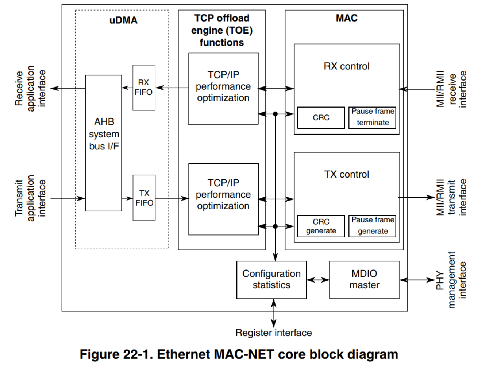
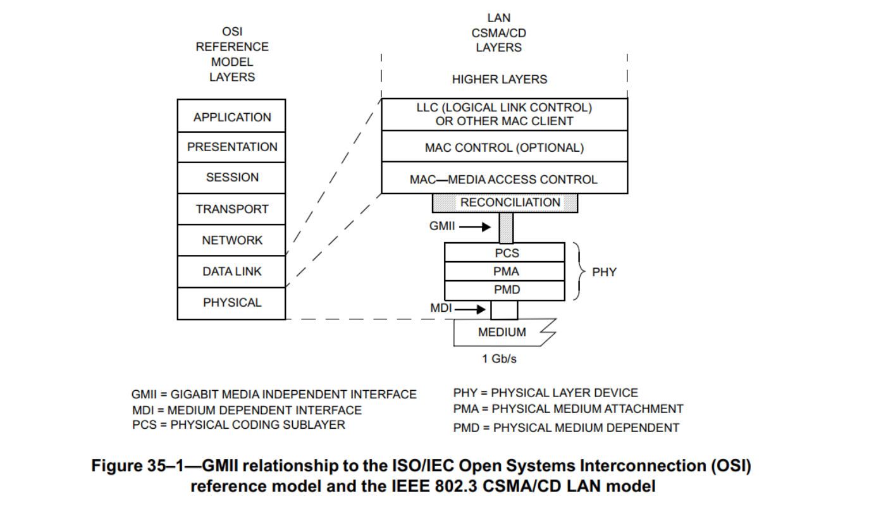

# 框架图

# 基础知识
- mdio、mdc 

# ethernet mac - 1588

> 
> Seamless interface to commercial ethernet PHY devices via one of the following:
• a 4-bit Media Independent Interface (MII) operating at 2.5/25 MHz.
• a 4-bit non-standard MII-Lite (MII without the CRS and COL signals) operating
at 2.5/25 MHz.
• a 2-bit Reduced MII (RMII) operating at 50 MHz
>

# MII、GMII、XGMII

# CPU 中断

[参考](https://www.codenong.com/27709349/)

## 问题
1. Simple 64-Bit FIFO user-application interface        
    这个是不是UIO中的中断内容
2. Allows reference clock to be chosen independently of network speed.      
    这个是什么意思？从哪里设置，是MII模块吗？
3. Supports hardware- and software-controllable timer synchronization.
   
4. Provides a 4-channel IEEE 1588 timer. Each channel supports input capture and output compare using the 1588 counter

# 随想录

1. 工业级和商业级的区别     
   温度上的区别，工业级更稳定，适应的温度范围更广。

2. 什么是phy?       
   port physical layer，端口物理层；以太网phy指的是一个芯片，用于传输以太网数据帧，但其没有MAC，只拥有和data link layer 中 MAC 通信的功能
